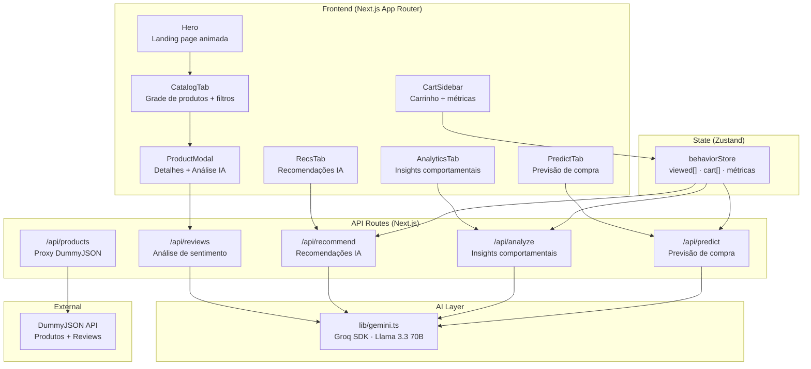
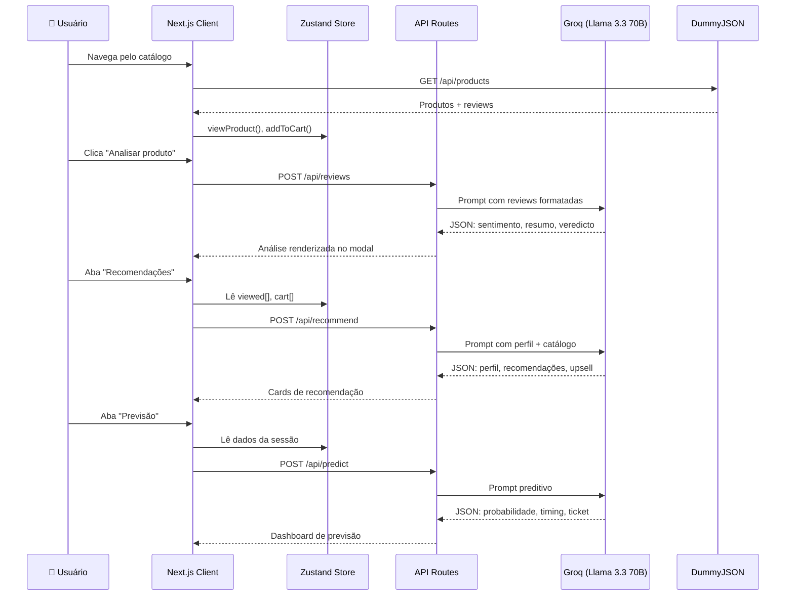

# 🛍️ ShopAI

> Motor de recomendação de e-commerce com IA em tempo real — construído com Next.js 14, Groq (Llama 3.3 70B) e Zustand.

[](https://nextjs.org/)
[](https://react.dev/)
[](https://www.typescriptlang.org/)
[](https://tailwindcss.com/)
[](https://groq.com/)

---

## 📸 Preview

ShopAI simula uma loja virtual inteligente onde **toda interação do usuário alimenta modelos de IA** que geram recomendações personalizadas, análise de sentimento de reviews, previsão de compra e insights comportamentais em tempo real — tudo com uma UI moderna e animações fluidas.

| Feature | Descrição |
|---------|-----------|
| 🧠 **Recomendações IA** | Perfil de compra analisado pela IA para sugerir produtos relevantes |
| 📊 **Analytics** | Insights comportamentais baseados na navegação do usuário |
| 🎯 **Previsão** | Probabilidade e timing de compra calculados por modelo preditivo |
| ⭐ **Análise de Reviews** | Sentimento, resumo e veredicto gerados a partir de reviews reais da DummyJSON |
| 🛒 **Carrinho Inteligente** | Sidebar com métricas de sessão: conversão, ticket médio, histórico |

---

## 🏗️ Arquitetura



---

## 📁 Estrutura de Pastas

```
shopai/
├── app/
│   ├── globals.css              # Estilos globais + keyframes + utilitários
│   ├── layout.tsx               # Root layout (metadata pt-BR)
│   ├── page.tsx                 # Página principal (tabs + hero)
│   └── api/
│       ├── products/route.ts    # GET  — Proxy da DummyJSON
│       ├── reviews/route.ts     # POST — Análise de sentimento das reviews
│       ├── recommend/route.ts   # POST — Recomendações personalizadas
│       ├── analyze/route.ts     # POST — Insights comportamentais
│       └── predict/route.ts     # POST — Previsão de compra
│
├── components/
│   ├── Hero.tsx                 # Landing page com shimmer, stats, CTA
│   ├── Navbar.tsx               # Barra de navegação + tabs
│   ├── AppBackground.tsx        # Fundo com orbs e partículas
│   ├── CartSidebar.tsx          # Carrinho + métricas de sessão
│   ├── ProductCard.tsx          # Card de produto (catálogo)
│   ├── ProductModal.tsx         # Modal de detalhes do produto
│   ├── CatalogTab.tsx           # Aba do catálogo (grid + filtros)
│   ├── RecsTab.tsx              # Aba de recomendações IA
│   ├── AnalyticsTab.tsx         # Aba de analytics comportamental
│   ├── PredictTab.tsx           # Aba de previsão de compra
│   ├── AIPanel.tsx              # Painel reutilizável de resultados IA
│   ├── card/
│   │   └── CardImage.tsx        # Imagem do card (badges, overlay, fallback)
│   ├── catalog/
│   │   ├── CatalogHeader.tsx    # Cabeçalho com métricas do catálogo
│   │   ├── CatalogToolbar.tsx   # Busca, filtros, ordenação
│   │   ├── CategoryIcons.tsx    # Ícones por categoria
│   │   └── SkeletonCard.tsx     # Skeleton loading dos cards
│   ├── hero/
│   │   ├── HeroBackground.tsx   # Grid + orbs + anéis + partículas
│   │   ├── StatCard.tsx         # Card de estatística com glass effect
│   │   └── SparkBurst.tsx       # Efeito de faíscas no hover
│   └── modal/
│       ├── ProductDetail.tsx    # Detalhes do produto (imagem, preço, tags)
│       └── AIAnalysis.tsx       # Botão + resultado da análise IA
│
├── lib/
│   ├── gemini.ts                # Cliente Groq + prompt builder
│   ├── products.ts              # Tipos: Product, ReviewData, ViewedProduct
│   ├── reviews.ts               # Reviews mock locais (fallback)
│   └── useCountUp.ts            # Hook de animação de contagem
│
├── services/
│   └── products.ts              # Fetch + mapeamento da DummyJSON → Product
│
├── store/
│   └── behaviorStore.ts         # Zustand: viewed[], cart[], métricas derivadas
│
├── .env.local                   # GROQ_API_KEY (não versionado)
├── tailwind.config.ts           # Cores, fontes, animações customizadas
├── tsconfig.json                # TypeScript strict, path alias @/*
├── next.config.js               # Permitir imagens remotas
└── package.json                 # Dependências e scripts
```

---

## 🔄 Fluxo de Dados



---

## 🎨 Design System

### Paleta de Cores

| Token | Cor | Uso |
|-------|-----|-----|
| `slate-50` | `#F8FAFC` | Background principal |
| `slate-900` | `#0F172A` | Texto principal, botões |
| `blue-500/600` | `#3B82F6` / `#2563EB` | Acentos IA, links |
| `sky-400` | `#38BDF8` | Indicadores de atividade |
| `emerald-500` | `#10B981` | Carrinho, estados positivos |
| `amber-400` | `#FBBF24` | Estrelas de rating |
| `violet-500` | `#8B5CF6` | Orbs decorativos |

### Fontes

| Variável | Família | Uso |
|----------|---------|-----|
| `--font-display` | **Syne** (Google Fonts) | Títulos, headings, preços |
| `--font-body` | **DM Sans** (Google Fonts) | Texto corrido, labels, UI |

### Animações

| Classe | Efeito | Duração |
|--------|--------|---------|
| `animate-shimmer` | Gradiente fluindo no texto | 4s ∞ |
| `animate-fade-up` → `-2`, `-3`, `-4` | Entrada em cascata com delay | 0.7s |
| `animate-stat-enter` | Entrada com bounce (cubic-bezier) | 0.7s |
| `animate-card-enter` | Cards entrando com stagger | 0.5s |
| `animate-float` / `-slow` / `-slower` | Flutuação orbital suave | 6–11s ∞ |
| `animate-orb-pulse` / `-delay` / `-slow` | Pulsação de orbs no fundo | 6–8s ∞ |
| `animate-glow-pulse` | Brilho pulsante no botão CTA | 3s ∞ |
| `animate-ring` / `-reverse` | Anéis decorativos rotativos | 20–24s ∞ |
| `ripple-effect` | Ondulação no clique | 0.6s |
| `animate-cart-pop` | Pop-in ao adicionar no carrinho | 0.4s |
| `skeleton-shimmer` | Shimmer nos skeletons de loading | 1.8s ∞ |

---

## 🚀 Como Rodar

### Pré-requisitos

- **Node.js** 18+
- **Chave da Groq** — crie uma conta gratuita em [console.groq.com](https://console.groq.com) e gere uma API key

### Setup

```bash
# 1. Clone o repositório
git clone https://github.com/seu-usuario/shopai.git
cd shopai

# 2. Instale as dependências
npm install

# 3. Configure a chave da Groq
echo "GROQ_API_KEY=gsk_seu_token_aqui" > .env.local

# 4. Rode o projeto
npm run dev
```

Abra [http://localhost:3000](http://localhost:3000) no navegador.

### Scripts

| Comando | Descrição |
|---------|-----------|
| `npm run dev` | Servidor de desenvolvimento com hot-reload |
| `npm run build` | Build de produção |
| `npm start` | Inicia o servidor de produção |

---

## 🧩 Stack Tecnológica

| Camada | Tecnologia | Por quê |
|--------|-----------|---------|
| **Framework** | Next.js 14 (App Router) | SSR, API Routes, otimização de imagens |
| **Linguagem** | TypeScript 5.9 (strict) | Segurança de tipos, DX |
| **Estilo** | Tailwind CSS 3.4 | Utilitário, customizável, performático |
| **Estado** | Zustand 4.5 | Leve, sem boilerplate, derivations |
| **Ícones** | Lucide React | Tree-shakeable, consistentes |
| **IA** | Groq SDK (Llama 3.3 70B) | JSON estruturado, baixa latência, gratuito |
| **Dados** | DummyJSON (proxy) | API realista de produtos com reviews |
| **Fontes** | Syne + DM Sans (Google Fonts) | Display moderno + body legível |

---

## 🔌 API Routes

### `GET /api/products`
Proxy da DummyJSON. Retorna o catálogo completo com produtos e reviews.

### `POST /api/reviews`
Analisa reviews de um produto com IA.

**Body:** `{ productName, productCategory, productPrice, reviews[] }`
**Response:** `{ sentimento_geral, score_confianca, resumo, pontos_fortes, pontos_fracos, perfil_ideal, veredicto, frase_destaque }`

### `POST /api/recommend`
Gera recomendações personalizadas baseadas no comportamento do usuário.

**Body:** `{ viewedNames, cartNames, topCat, avgPrice, viewedCount, cartCount }`
**Response:** `{ perfil, recomendacoes[], upsell, urgencia }`

### `POST /api/analyze`
Analisa padrões de navegação e gera insights de CRO.

**Body:** `{ viewedNames, cartNames, topCat, avgPrice, viewedCount, cartCount }`
**Response:** `{ segmento, insights[], acao_prioritaria }`

### `POST /api/predict`
Prevê probabilidade e timing de compra.

**Body:** `{ viewedNames, cartNames, topCat, avgPrice, viewedCount, cartCount }`
**Response:** `{ probabilidade, timing, categoria_mais_provavel, ticket_estimado, confianca, acao_recomendada, gatilho_principal, scores_categoria }`

---

## 📦 Zustand Store

```typescript
interface BehaviorStore {
  viewed: ViewProduct[]      // Últimos 10 produtos visualizados
  cart: Product[]            // Produtos no carrinho
  sessionStart: Date         // Início da sessão

  viewProduct(p)             // Registra visualização (+15s timeSpent)
  addToCart(p)               // Adiciona ao carrinho + registra view
  removeFromCart(id)         // Remove do carrinho
  clearCart()                // Limpa carrinho
  clearHistory()             // Limpa tudo

  cartTotal()                // Soma dos preços
  topCategory()              // Categoria mais visitada
  avgPrice()                 // Ticket médio
  conversionRate()           // Taxa de conversão (cart/viewed)
}
```

---

## 🎯 Funcionalidades

- [x] Catálogo com grid responsivo (2 → 6 colunas)
- [x] Busca por nome, categoria e tags
- [x] Filtro por categoria com chips
- [x] Ordenação por relevância, menor/maior preço
- [x] Modal de detalhes do produto
- [x] Análise IA de reviews (Groq Llama 3.3 70B)
- [x] Recomendações personalizadas por comportamento
- [x] Insights de analytics comportamental
- [x] Previsão de compra com scores por categoria
- [x] Carrinho lateral com total e histórico
- [x] Indicador de produtos já visualizados
- [x] Skeleton loading com shimmer
- [x] Animações de entrada, hover e transições
- [x] Hero page com shimmer text, glass stats, orbs animados
- [x] Responsivo (mobile, tablet, desktop)
- [x] Reviews reais da DummyJSON com fallback local

---

## 📄 Licença

MIT — sinta-se livre para usar, modificar e compartilhar.

---

🤖 Feito com [Claude Code](https://claude.ai/code) · Next.js · Groq · DummyJSON
